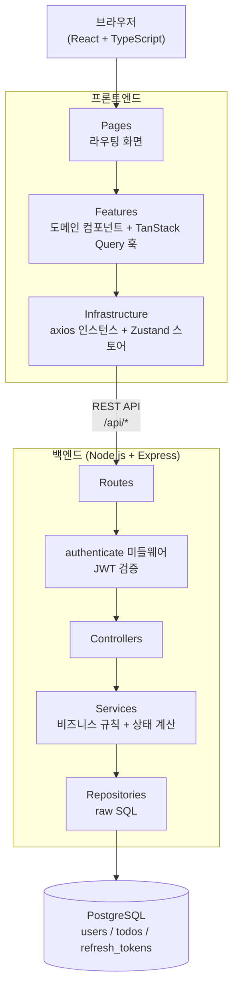

# 시스템 아키텍처 다이어그램

```mermaid
graph TD
    클라이언트["브라우저\n(React + TypeScript)"]

    subgraph 프론트엔드
        Pages["Pages\n라우팅 화면"]
        Features["Features\n도메인 컴포넌트 + TanStack Query 훅"]
        Infra["Infrastructure\naxios 인스턴스 + Zustand 스토어"]
    end

    subgraph 백엔드["백엔드 (Node.js + Express)"]
        Routes["Routes"]
        Auth["authenticate 미들웨어\nJWT 검증"]
        Controllers["Controllers"]
        Services["Services\n비즈니스 규칙 + 상태 계산"]
        Repositories["Repositories\nraw SQL"]
    end

    DB[("PostgreSQL\nusers / todos / refresh_tokens")]

    클라이언트 --> Pages
    Pages --> Features
    Features --> Infra
    Infra -->|"REST API\n/api/*"| Routes
    Routes --> Auth
    Auth --> Controllers
    Controllers --> Services
    Services --> Repositories
    Repositories --> DB
```
